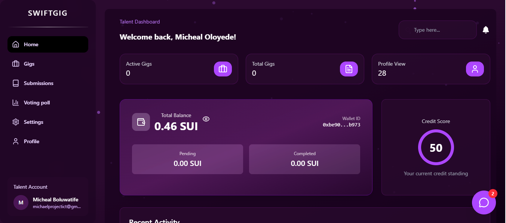

# SwiftGig

[](LICENSE)
[](https://github.com/Kars07/SwiftGig/issues)
[](https://github.com/Kars07/SwiftGig/stargazers)

SwiftGig is an open-source gig management application written in Swift. It is designed to help freelancers, gig workers, and project managers easily organize, track, and manage their gigs, tasks, and clients efficiently. Whether you are working solo or as part of a team, SwiftGig provides a robust platform to streamline your workflow and maximize productivity.

---

## Features

- **Intuitive Dashboard**: Get a quick overview of your upcoming gigs, pending tasks, and client communications.
- **Gig Management**: Create, edit, and categorize gigs with status tracking (e.g., upcoming, in progress, completed).
- **Task Scheduling**: Add detailed tasks to each gig, set deadlines, and receive notifications.
- **Client Database**: Store and manage client information securely, including contact history and notes.
- **Analytics & Reports**: Visualize your productivity, earnings, and completed gigs over time.
- **Cross-Platform Support**: Optimized for both macOS and iOS devices.
- **Offline Access**: Work on your gigs and tasks even without an active internet connection.
- **Modern SwiftUI Interface**: Clean, fast, and responsive user experience leveraging the latest SwiftUI features.

---

## Screenshots



--- 

## 🚀 Key Features

### 🧑‍💻 Talent Dashboard
- Manage gigs, earnings, and job history in one place.  
- Submit proposals and communicate directly with clients.  
- View real-time analytics on job performance and ratings.  
- Withdraw funds instantly using blockchain-enabled payouts.  
- Access a credit score that reflects reliability and performance.

### 🧑‍💼 Client Dashboard
- Post new gigs and track submissions easily.  
- Hire top-rated freelancers with transparent review systems.  
- Manage ongoing projects and milestone payments.  
- View spending insights and payment history.  
- Verify completed work using timestamped proof stored on-chain.

---

## 💸 Instant Payout System
SwiftGig leverages blockchain technology to provide **instant, secure, and transparent payments**.  
No more waiting days for withdrawals — once a job is approved, freelancers get paid **instantly** through smart contracts.

---

## 🔗 Blockchain-Powered Infrastructure
- Built on a decentralized payment architecture for security and transparency.  
- Smart contracts handle escrow and automatic payment releases.  
- On-chain proof ensures trust and eliminates disputes.

---

## 🛠️ Tech Stack

**Frontend:** React + Vite + TypeScript + Tailwind CSS  
**Backend:** Node.js + Express + MongoDB  
**Blockchain Layer:** Smart contracts for escrow & instant payout  
**Authentication:** JWT + OAuth + Email verification  

---

## 🌍 Vision

SwiftGig aims to empower the next generation of freelancers across Africa and beyond by providing a **trustless, borderless, and inclusive gig economy**.  
It bridges the gap between talent and opportunity through **automation, transparency, and instant reward systems**.

---

## 🧩 Core Modules
| Module | Description |
|--------|--------------|
| 🧠 Auth System | Secure login, register, and email verification |
| 💼 Dashboard | Separate views for talents and clients |
| 💰 Wallet | Manage balance, view transactions, and withdraw instantly |
| 🪙 Smart Contracts | Handles escrow and auto-payouts |
| ⭐ Ratings & Reviews | Build credibility and trust between users |
| 📈 Analytics | Get insights into work history and earnings |

---

## 🧠 Future Roadmap
- 🌐 Multi-chain support (Arbitrum, Cardano, etc.)  
- 📱 Mobile app for Android and iOS  
- 🧾 AI-powered gig recommendations  
- 🛡️ Decentralized reputation scoring  

---

## 👥 Team
SwiftGig is developed by **a passionate team of developers and innovators** dedicated to building the future of work — decentralized, instant, and borderless and it is comprised
of a team across most stacks, Frontend, Backend, Smart-Contract Developer, AI/ML, Product Design, Data science and CyberSecurity.

---

## 📜 License
This project is licensed under the **MIT License** — feel free to use, modify, and contribute.

---

### 💬 Connect with Us
If you'd like to collaborate or contribute, feel free to open an issue or reach out via GitHub discussions.

> **SwiftGig — Work Faster. Get Paid Instantly.**

### Installation

1. **Clone the repository:**
    ```bash
    git clone https://github.com/Kars07/SwiftGig.git
    cd SwiftGig
    ```

2. **Open the project in Xcode:**
    - Double-click `SwiftGig.xcodeproj` or `SwiftGig.xcworkspace`.

3. **Build & Run:**
    - Select your target device (Mac, iPhone, or Simulator) and hit **Run** (⌘R).

---

## Usage

- **Add a Gig**: Click the "Add Gig" button on the dashboard. Fill in details like title, client, deadline, and description.
- **Track Tasks**: Within a gig, add tasks, set priorities, and check them off as you go.
- **View Reports**: Navigate to the Analytics section to see your performance and earning trends.

---

## Roadmap

- [ ] Integration with popular calendar apps
- [ ] Cloud sync and backup
- [ ] Invoice generation and payment tracking
- [ ] Team collaboration features

---

## Contributing

Contributions are welcome!  
To contribute, please fork this repository and submit a pull request. For major changes, open an issue first to discuss what you would like to change.

1. Fork the Project
2. Create your Feature Branch (`git checkout -b feature/AmazingFeature`)
3. Commit your Changes (`git commit -m 'Add some AmazingFeature'`)
4. Push to the Branch (`git push origin feature/AmazingFeature`)
5. Open a Pull Request

See [CONTRIBUTING.md](CONTRIBUTING.md) for more details.

---

## License

Distributed under the MIT License. See [`LICENSE`](LICENSE) for more information.

---

## Contact

- **Author:** [Kars07](https://github.com/Kars07)
- **Project Link:** [https://github.com/Kars07/SwiftGig](https://github.com/Kars07/SwiftGig)
- **Issues & Feedback:** Please use the [issue tracker](https://github.com/Kars07/SwiftGig/issues).

---

## Acknowledgements

- SwiftGig
- All open-source contributors and the SwiftGig community